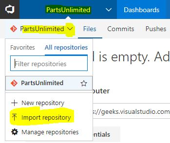

# Goal
Setup Parts Unlimited codebase in git in Team Services.

# Pre-Requisites
Prior to setting up Parts Unlimited in git, ensure you have completed the following steps, 
+ Validate Parts Unlimited works locally on your developer machine [HOL](https://github.com/tarunaroraonline/PartsUnlimitedHOL/blob/master/docs/01_HOL_PartsUnlimited_PreReq-WorkingEnvironment/README.md)
+ You have an active instance of Visual Studio Team Services [Sign Up for Free Account](https://www.visualstudio.com/team-services/)

# Importing PartsUnlimited into git in Team Services
Visual Studio Team Services now has git import functionality that allows you to import any git repository that exposes a public endpoint directly into Team Services. We'll leverage this functionality to directly import the Parts Unlimited repository from GitHub into Team Services. 
+  Launch your Visual Studio Team Services instance in a Browser and create a new project called Parts Unlimited. Select the defaults when creating the new team project. 

   
+ Navigate to the Code Hub and choose import repository. 

   
+ Fill out the details of the repository you intend to import and the name for the repository in Team Services. 

  > To import Parts Unlimited specify the source as **[https://github.com/tarunaroraonline/PartsUnlimitedHOL](https://github.com/tarunaroraonline/PartsUnlimitedHOL)**  

  

+ The import process is fairly quick, it can take a minute or so to complete... 

  

+ Import brings across all branches and the entire history of the repository along with it...

  

> ### Congratulations! You now have parts unlimited set up in your very own Team Services git repository... 

 # Summary 
At this point you should have a working version of the parts unlimited codebase setup in git in your very own instance of Visual Studio Team Services. If you have any issues with the setup contact [@arora_tarun](https://twitter.com/arora_tarun). Like DevOps, check out [http://www.visualstudiogeeks.com/](http://www.visualstudiogeeks.com/) #DevOpsOn 

