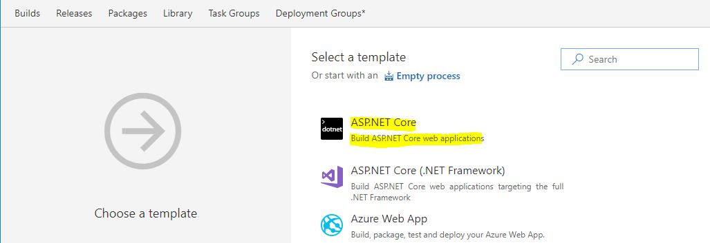

# Goal
Leverage Team Build in Team Services to set up an automated Continuous Integration (CI) pipeline for Parts Unlimited Website.  

# Pre-Requisites
It is recommended that you complete the previous hands on labs prior to setting up a CI pipeline for parts unlimited website.  
+ Validate Parts Unlimited works locally on your developer machine [HOL 1](https://github.com/tarunaroraonline/PartsUnlimitedHOL/blob/master/docs/01_HOL_PartsUnlimited_PreReq-WorkingEnvironment/README.md)
+ You have an active instance of Visual Studio Team Services [Sign Up for Free Account](https://www.visualstudio.com/team-services/)
+ Import Parts Unlimited from GitHub into git in Team Services [HOL 2](https://github.com/tarunaroraonline/PartsUnlimitedHOL/blob/master/docs/02_HOL_Setup_PartsUnlimited_In_TeamServices/README.md)

# Setting up a CI pipeline for Parts Unlimited using Team Build
Visual Studio Team Services now has git import functionality that allows you to import any git repository that exposes a public endpoint directly into Team Services. We'll leverage this functionality to directly import the Parts Unlimited repository from GitHub into Team Services. 
+  Launch your Visual Studio Team Services instance in a Browser and navigate to the code hub, from the top right section click on `Set up build`

  > While this is one of the entry points to `Set up build`, you can also choose to set up a new build pipeline from the build hub. 

  

+ Navigate to the Code Hub and choose import repository. 

   

+ Team Services now has an out of box template for DotNetCore, choose the template `ASP.NET Core` from the list of featured templates. 

  

+ The out of box template setup pretty much everything for you. Change the name of the build pipeline to `partsunlimited`

  

+ The Team Services hosted agent supports building Dot Net Core applications, to execute the build pipeline on the hosted agent choose the Agent queue as `Hosted VS2017`

  

+ In order to scope the build to the parts unlimited website only. Change the process parameter `projects to restore and build` to `src\PartsUnlimitedWebsite\*.csproj` 
  
   

+ The build is defaulted to the branch that you had open in the code hub, in this case it's the `master` branch. 

  

+ Configure the build Trigger to be `Continuous Integration` so the build is triggered on every commit within this repository

  

  > You can optionally include or exclude other git repositories to trigger this build, you can also optionally select to batch changes while a build is in progress and last but not the list add or remove certain paths of the repository influencing the trigger.  

+ At this point simply save and queue a new build to trigger test the CI pipeline...

   

+ The build should succeed and you should see the build summary show the test execution results... 
  

> ### Congratulations! You now have an automated CI pipeline for Parts Unlimited! 

 # Summary 
At this point you should have an automated CI pipeline of the parts unlimited in your very own instance of Visual Studio Team Services. If you have any issues with the setup contact [@arora_tarun](https://twitter.com/arora_tarun). Like DevOps, check out [http://www.visualstudiogeeks.com/](http://www.visualstudiogeeks.com/) #DevOpsOn 

